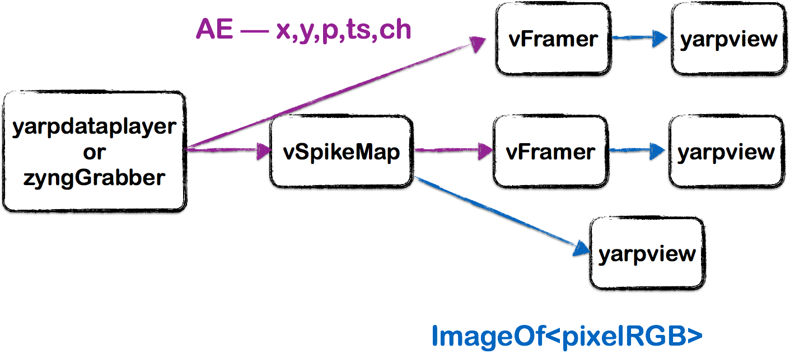

Using Spiking Neuron Models 
=============================

Create an event-driven spiking map based on the leaky integrate and fire neural model

# Prerequisites
By now, you should have learnt what an event is and how to read and write events in bottles, (e.g. in the  [Optical Flow](https://github.com/vvv-school/tutorial_event-driven-flow) tutorial).

# Assignment
We want you to modify the Callback function (OnRead()) to 

1. Correctly handle event packets using the event library
1. Create an activity map where each point is a neuron that integrates the activity of the corresponding input pixel for each incoming event. 
1. Implement a model of **integrate and fire neuron**: its energy increases for each input event and decays exponentially over time. When the energy exceeds a given threshold, the neuron emits an event and is reset.
1. Create an output bottle of events generated by the neurons in the map (each event has x,y,t,p,ch information).
1. Send the bottle to yarp.

You should be able to visualise the subthreshold activity map of the neurons as an image stream in yarpview and the output events from the map by using `vFramer`, running the _yarpmanager script_ provided from within [**app/scripts**](./app/scripts/)

The structure of the application should look like:

You will run this assignment with the [_Dataset_event-spiking-model_]() dataset. The regions where a lot of events sum over time will produce output events.

Some of the points reported above have been already addressed in the code, so you need to **fill in the missing gaps** highlighted by the comment `// FILL IN THE CODE`.

Once done, you can test your code **Automatically**: [running the script **test.sh**](https://github.com/vvv-school/vvv-school.github.io/blob/master/instructions/how-to-run-smoke-tests.md) in the **smoke-test** directory. 

# [How to complete the assignment](https://github.com/vvv-school/vvv-school.github.io/blob/master/instructions/how-to-complete-assignments.md)
